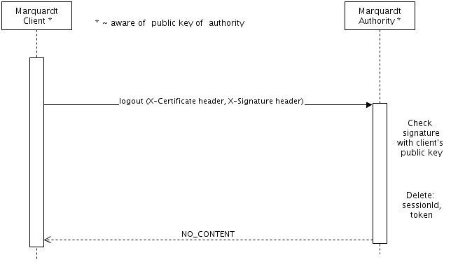

# Marquardt Java SDK
[](https://travis-ci.org/echocat/marquardt-java-sdk)
[](https://coveralls.io/github/echocat/marquardt-java-sdk?branch=master)
[](https://www.versioneye.com/user/projects/55f2c1ced4d2040019000161)
[](http://mozilla.org/MPL/2.0/)

_echocat Marquardt_ is a certificate based distributed authentication / authorization framework.

It uses a central __authority__ which holds the session of a user. The authority produces certificates which are signed using a key pair with a public key trusted by Marquardt services and clients. Certificates have a short time to live of ~ 15 minutes. When they are expired, they must be refreshed.

__Clients__ communicate with the authority to obtain a certificate. They can use the certificate to read the roles of a user to allow access to client features and to get basic user information for presentation. They also use the certificate to access protected services.

__Services__ can authenticate and authorize client requests without roundtrips to the central authority. They read the certificate from the request header and check the requests are also signed by the client (whose public key is contained in the certificate). They use embedded payload from the certificate to access necessary user information.

### Marquardt Sign In Process

In order to access protected services, a client must obtain a certificate issued by the authority. The following diagram explains the basic process: A client sends its credentials to the authority. The authority checks that the user exists and its credentials are valid, creates a new session if necessary and issues the certificate.


### Marquardt Refresh Process

Certificates expire after ~15 minutes and need to be refreshed by the client:


### Marquardt Sign Out Process

To log out, a client must send its current certificate - also expired ones - to the authority sign out endpoint:



## Modules

### Common
[](https://www.versioneye.com/user/projects/55f2c543d4d2040019000197)

This module contains generic shared classes like custom exceptions and json (de-)serializers. Most notably, this module provides the basic infrastructure for the creation and
validation of signatures and certificates.

Signable payload is created by implementing _Signable_. Deserialization from byte arrays to the object type is performed by implementations of _DeserializingFactory_.
The factory consumes a byte input stream and produces the deserialized signable.

The _Signer_ class is used to create signatures for signables. The _Validator_ is used to both deserialize signables using the respective _DeserializingFactory_ and to verify
their signatures.

#### Certificates

A _certificate_ is a special case of a signable: It is both a signable itself and also contains a signable as a payload object. In addition, a certificate contains

* the public key of the issuer entity
* the public key of the recipient of the certificate
* an expiry date and
* authorization roles.


Deserialization is performed with _CertificateFactory_. The deserialization factory of the wrapped payload object (contained in the certificate) can be obtained with
_getFactoryOfWrapped_.

#### The certificate byte format

Certificates are transported in a serialized byte format. The authority returns newly issued certificates as a JSON object ( _JsonWrappedCertificate_ ) containing the
certificate bytes in the 'certificate' attribute. Clients provide the certificate to the authority and services in an _X-Certificate_ request header. The certificate is always
transported Base64 encoded.

<pre>
[[ VERSION ] [ ISSUER PUBLIC KEY ] [ CLIENT PUBLIC KEY ] [ EXPIRY DATE ] [ ROLES ] [ USER INFO PAYLOAD ]]   [[ AUTHORITY SIGNATURE  ]]
</pre>

* VERSION - Version of the issued certificate.
* ISSUER PUBLIC KEY - The public key of the authority that issued the certificate
* CLIENT PUBLIC KEY - The public key of the client the certificate is issued for.
* EXPIRY DATE - expiry date of the certificate.
* ROLES - A 64-bit value (Java long) that encodes the user roles as bits.
* USER INFO PAYLOAD - the payload: User information about the client.
* AUTHORITY SIGNATURE - Signature of the authority.

### Authority
[](https://www.versioneye.com/user/projects/55f2c44ad4d204001c00011d)

This module contains all code related to the _authority_, the central entity that all clients must authenticate with and that will issue certificates and manage client sessions.

In order to use the authority, the following interfaces must be implemented:

* _Signable_ - The Signable payload to be included in the certificate. This is usually a subset of the user information or even just the user id or some other identifier.
* _User_ and _UserStore_ - The user object and its persistency store. The user store also provides a method to translate from a user object to the signable certificate payload.
* _Session_ and _SessionStore_ - The server session and its persistency store.

### Client
[](https://www.versioneye.com/user/projects/55f2c431d4d204001c000118)

Contains the client interface and a Spring-based implementation. The request signer class can create signatures of the specified request headers. In the Spring implementation it
is integrated as part of a HTTP interceptor that adds all required headers (signature and certificate) to the request.

### Service
[](https://www.versioneye.com/user/projects/55f2c432d4d204001e0000c7)

This module provides the required infrastructure to implement a Marquardt-protected service: The _CertificateAuthenticationFilter_ is a servlet filter that extracts the certificate
from the X-Certificate request header, deserializes it and validates it. In addition, it validates the http request signature with the client's public key from the certificate. If all
validations pass, the filter authenticates the user.

The actual authentication process (e.g. creation of security principals) is left to the implementation. An implementation for Spring Security is provided as
_SpringSecurityCertificateAuthenticationFilter_.

### Example
[](https://www.versioneye.com/user/projects/55f2c431d4d2040019000185)

This module is a Spring Boot example application that showcases how to use the different Marquardt components. Start the application by running the _ExampleApplication_ main class.

The example project implements session and user persistence with an H2 database and Spring Data repositories. The REST API of the authority is based on the provided Spring MVC controller.

The class _ExampleServiceController_ implements a simple service API with both protected and unprotected endpoints. For example usage and client calls, see the integration tests of the module:
_AuthenticationIntegrationTest_ and _ServiceLoginIntegrationTest_.

## How to Contribute

Please activate the provided pre-commit hook to ensure no files without license information are committed. To activate the hook, please run:

```
cd .git_hooks
./enable_hooks.sh
```

## Credits

[](https://teufelaudio.com) [](https://raumfeld.com)

Development of this project is sponsored by [Lautsprecher Teufel GmbH](https://teufelaudio.com) and is used in their [Raumfeld products](https://raumfeld.com).


## License

This Source Code Form is subject to the terms of the Mozilla Public
License, v. 2.0. If a copy of the MPL was not distributed with this
file, You can obtain one at http://mozilla.org/MPL/2.0/.

